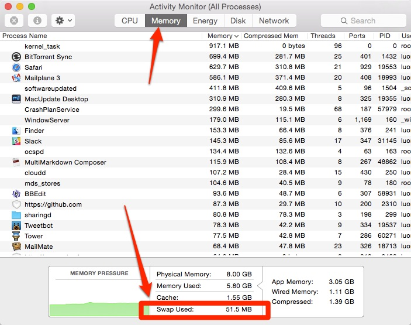

# textbar

Centralized repo for scripts I use with [TextBar](http://www.richsomerfield.com/apps/).

(See [my TextBar review here](http://www.macstories.net/mac/textbar-puts-your-text-into-the-menu-bar/).)

## textbar-diskspace.sh

Show available diskspace:

	/bin/df -H '/' \
	| /usr/bin/awk -F' ' '/ [0-9]/{print $4}'

## textbar-ip.sh

Show public IP, if found.

	IP=`curl -sfL 'http://ipinfo.io/ip'`

	if [[ "$IP" == "" ]]
	then
		echo "! No IP found !"
	else
		echo "$IP"
	fi

## textbar-mount-count.sh

How many mounted drives are there (other than boot drive)?

	find /Volumes/* -maxdepth 0 -type d -print | wc -l | tr -dc '[0-9]'

Gives slightly better formatted output.

## textbar-relayfm.sh

Is there currently a live show being recorded on [Relay.fm](http://www.relay.fm/live)?

## textbar-spotify.sh

Show the currently playing song in Spotify (if any).

## textbar-ssid.sh

Use Apple’s `airport` command to show the current Wi-Fi network that this Mac is attached to.

## textbar-swap.sh

Show how much swap space this Mac is using.

	/usr/bin/top -S -n0 -l1 \
	| /usr/bin/awk -F' ' '/^Swap/{print $2}'

Same info as found in **Activity Monitor.app** as shown here:

Thanks to [@darkuncle](https://twitter.com/darkuncle/status/593513107940454400) for that one.

## textbar-timedate.sh

Uses GNU’s `date` to get the exact time/date format I want:

	/usr/local/bin/gdate +'%-I:%M %P (%a %b %d)'

Example output:

	2:43 pm (Thu Apr 30)

